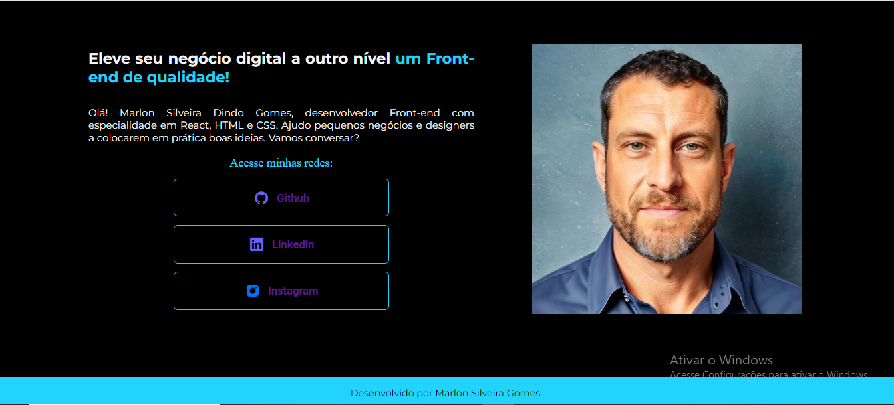
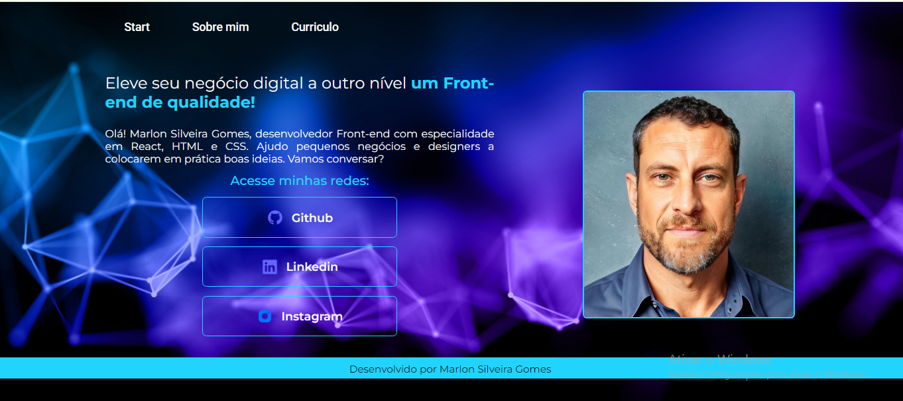

README DOC PORTIFÓLIO

Este projeto foi iniciado no curso de Iniciante em Programação Alura & ONE.

Utilizamos linguagem de marcação HTML & CSS e posteriormente será incluida JavaScript.

O site ainda está em atualização, porém já está disponivel a ultima versao no Vercel: (https://vercel.com/marlonsilveiragomes-projects/portifolio)

Estrutura:

>assets .
>styles .
>DOC PORTIFÓLIO READ.md
<>about.html .
<>curriculo.html .
<>index.html .

Ultimas atualizaçõe:

Página início antiga:  

Página Início atualizada: 

